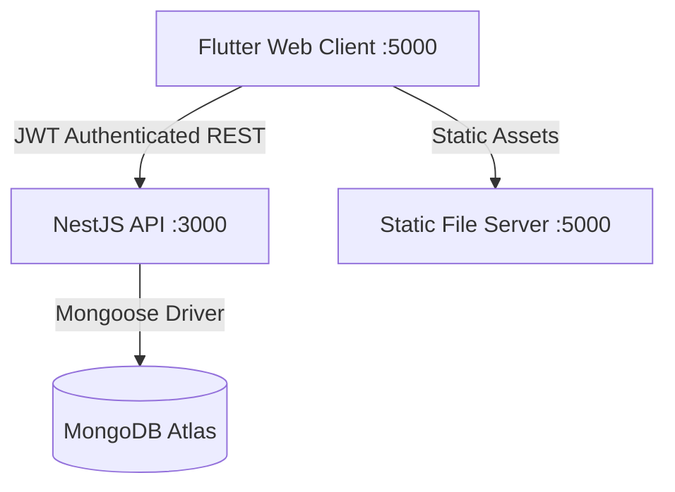

# Project Architecture - EBZIM APP

## 1. Overview
The EBZIM platform is a decentralized multi-tier application designed for high-performance heritage content delivery and secure membership management.

## 2. Technical Stack

### Frontend (User Interface)
- **Framework**: Flutter Web (Stable Channel).
- **State Management**: Riverpod (Functional Providers).
- **Navigation**: GoRouter.
- **Serving Strategy**: **Static Site Serving**.
  - Due to browser complexity with hundreds of micro-modules in development mode, we use `flutter build web --release`.
  - The build is served via a custom Node.js script `serve_static.js` on port 5000.

### Backend (API Engine)
- **Framework**: NestJS (TypeScript).
- **API Standard**: RESTful with `api/v1` prefix.
- **Database Layer**: Mongoose (ODM).
- **Security**: Passport.js with JWT Strategy.

### Infrastructure
- **Cloud Provider**: MongoDB Atlas.
- **IP whitelisting**: Configured for the current development network.

## 3. Communication Flow

## 4. Key Logic Locations

### Authentication Flow
- **Frontend Entry**: `lib/screens/login_screen.dart`
- **Frontend Auth Service**: `lib/core/services/auth_service.dart`
- **Backend Guard**: `ebzim-backend/src/common/guards/jwt-auth.guard.ts`
- **Backend Service**: `ebzim-backend/src/modules/auth/auth.service.ts`

### Content Management (News/Posts)
- **Backend Controller**: `ebzim-backend/src/modules/posts/posts.controller.ts`
- **Backend Controller Alias**: `ebzim-backend/src/modules/posts/news.controller.ts` (Handles `/news` compatibility).
- **Frontend Service**: `lib/core/services/news_service.dart`

### Localization (i18n)
- **Source Files**: `lib/core/localization/l10n/*.arb`
- **Generated Files**: `lib/core/localization/l10n/app_localizations_*.dart`
- **Standard**: Professional institutional Arabic (Aref Ruqaa / Cairo fonts).

## 5. Environment & Secrets
- **Backend**: Managed via `ebzim-backend/.env`.
- **Frontend**: Base URL dynamically resolved in `lib/core/services/api_client_platform_web.dart`.
